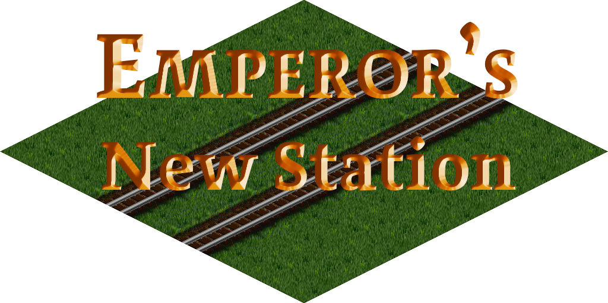

Emperor's New Station
=====================




"I could not find a single error or mistake in the entire work." — The Inspector

"Such seamless integration with the landscape deserves a grand celebration." — The Emperor

"The construction is highly resistant to wear; our upkeep costs have been minimal." — The Foreman

"The views in every direction are simply magnificent." — A Traveler

"I have never felt so unconfined while waiting for a train." — A Visitor

_Welcome to the Emperor’s New Station!_

# Introduction

Two architects arrived at the Emperor's court, claiming they could build magnificent stations of unparalleled beauty—visible only to the wise and competent, but completely invisible to anyone who was stupid or unfit for their position.

The officials inspected the work and returned praising that they could not find a single error or mistake. The Emperor himself visited the site and was so impressed by the seamless integration with the landscape that he commanded a grand parade.

On the day of the parade, the citizens gathered to admire these celebrated stations across the land, each describing the magnificent structures they perceived. The Emperor stood proudly before his people, surrounded by the finest stations his realm had ever seen.

On a more serious note, this NewGRF provides railway stations, bus stations, and waypoints that reuse base set bare ground graphics. They can be used to make functional stations that are "invisible".

# Building
## Preparation
This depends on an up-to-date version of `agrf`, which in turn depends on `grf-py`. You can install the dependencies by using `pip`:

```bash
$ pip install -r requirements.txt
```

## Make
After installing dependencies, run `make` to build the newGRF.

# Licensing and Contribution
GPLv2+.
